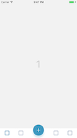
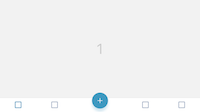
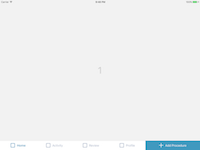

Flexible Tab Bar is a custom approach to the tab bar that allows you to create different views for different *orientations*/*devices* or *states*. iOS default `UITabBar` is limited and it is really hard to customize it for different device states.

## Preview
- Portrait (with a different type of button in the middle and different presentation when tapped)
  <br>
- Landscape (same tab layout as for the portrait one)
  <br>

## And for iPad:
- Portrait (the middle button is now placed at the end and has the same presentation style as the rest of the tab pages)
  <br>
- Landscape (same tab layout as for the portrait one but now it displays the tab item title since it has more space to expand)
  <br>


## Adding to your project

To add open-tab-bar via [CocoaPods](http://cocoapods.org/) into your project just create a `Podfile` and add this line:
```ruby
pod 'open-tab-bar'
```
Install the pod by running `pod install`

## Usage

#### 1. Extending the controller
First extend your view controller from `WKTabBarController`:

```swift
class ViewController: WKTabBarController {

}
```
#### 2. Setting the items
You can set the items in the `viewDidLoad` function via the `tabBarItems` property:

```swift
tabBarItems = [
  WKTabBarItem(title       : TAB_ITEM_TITLE,
               image       : NORMAL_IMAGE,
               highlighted : HIGHLIGHTED_IMAGE, (OPTIONAL)
               selected    : SELECTED_IMAGE     (OPTIONAL)
  )
]
```

#### 3. Customizing the items
`WKTabBarController` already implements the `WKTabBarControllerProtocol`, so in your `ViewController` you can `override` these methods in order to customize the appearance of the items:

```swift
func tabBarController(_ controller: WKTabBarController, cellNameAtIndex index: Int) -> WKTabBarCellName
func tabBarController(_ controller: WKTabBarController, customize cell: WKBaseTabBarCell, with item: WKTabBarItem, at index: Int)
```

The line below allows you to return the view controller that you want to be shown. If you decide you want to do something that doesn't implies showing a controller just do you thing and then `return nil`.
```swift
func tabBarController(_ controller: WKTabBarController, viewControllerAtIndex index: Int) -> UIViewController?
```

#### 4. Customizing the tab bar item

Create a class that extends the `WKBaseTabBarCell` class:
```swift
final class CustomTabBarItem: WKBaseTabBarCell {

}
```

In this class you can override these methods in order to customize the appearance of the item:
```swift
open func set(model: WKTabBarItem) // called when setting the tab bar model
open func commonInit()             // called when initialized
open func set(highlighted: Bool)   // called when the item should change its appearance on highlighted
open func set(selected: Bool)      // called when the item should change its appearance on selected
```

After this don't forget to register the new class with this line:
```swift
self.register(cell: CustomTabBarItem.self, withName: "CustomTabBarItem")
```

And you can now return the custom cell to be displayed:
```swift
func tabBarController(_ controller: WKTabBarController, cellNameAtIndex index: Int) -> WKTabBarCellName {
  return "CustomTabBarItem"
}
```

## Credits
[Adrian Mateoaea](https://github.com/adrianitech)

## License
